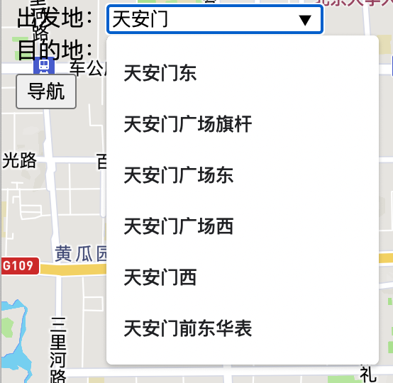

# emap

emap使用[OpenStreetMap](https://www.openstreetmap.org)提供的真实世界数据构建地图模型，实现导航的功能，并以web的形式部署在服务器上。用户只需在浏览器中输入出发地和目的地即可获得导航的具体信息，导航路线也会展示在地图上。

- 后端：基于Go语言标准库开发。解析地图数据，并REST风格的api的形式向用户提供地点查询和路径导航的功能。
- 前端：地图可视化部分使用[Mapbox GL JS](https://docs.mapbox.com/mapbox-gl-js/guides/)实现，用jQuery ajax获取后端数据。


## 后端

后端由streetmap、router和server三部分构成，具体的功能如下：

- streetmap：将OpenStreetMap数据解析为有向图的数据结构，并利用k-d树实现地图点中的最近邻查询，利用字典树实现通过名称查询地点。
- router：使用A*算法实现导航路线的规划，并以文字形式给出具体的导航路线信息。
- server：构建http服务器以REST风格的api的形式向用户提供streetmap和router的功能。

### streetmap

#### OpenStreetMap

OpenStreetMap (OSM)是一个免费的可编辑的世界地理数据库，以xml的格式存储。通过其提供的Overpass API可以很轻松的从浏览器下载感兴趣位置的地图数据。

本项目选用北京市区（五环内）作为地图数据，只关注数据库中的两类数据，分别是[Node](https://wiki.openstreetmap.org/wiki/Node)和[Way](https://wiki.openstreetmap.org/wiki/Way)。Node即地图中的点的各种信息，包括id、名称、经纬度等；Way即地图中道路的信息，包括id、名称、路上的Node列表等。

```XML
<!-- OpenStreetMap 数据示例 -->
<node id="2103119706" lat="39.9322003" lon="116.3978560" version="3" timestamp="2021-12-13T03:15:11Z" changeset="114864802" uid="6921384" user="Herman Lee">
  <tag k="bus" v="yes"/>
  <tag k="highway" v="bus_stop"/>
  <tag k="name" v="南锣鼓巷"/>
  <tag k="name:zh" v="南锣鼓巷"/>
  <tag k="public_transport" v="platform"/>
</node>

<way id="4484630" version="35" timestamp="2021-11-30T13:07:48Z" changeset="114402703" uid="10360149" user="Thregren">
  <nd ref="8835880545"/>
  <nd ref="9296258002"/>
  <nd ref="2382659522"/>
  <nd ref="733859240"/>
  <nd ref="2382659526"/>
  <nd ref="2382659525"/>
  <nd ref="733860100"/>
  <nd ref="26535595"/>
  <nd ref="9296258001"/>
  <nd ref="9296258000"/>
  <tag k="highway" v="primary"/>
  <tag k="name" v="东长安街"/>
  <tag k="name:en" v="East Chang'an Street"/>
  <tag k="name:ru" v="улица Дун-Чанъаньцзе"/>
  <tag k="name:vi" v="Đường Đông Trường An"/>
  <tag k="name:zh" v="东长安街"/>
  <tag k="name:zh-Hans" v="东长安街"/>
  <tag k="name:zh_pinyin" v="Dōng-Cháng'ān-jiē"/>
  <tag k="oneway" v="yes"/>
</way>
```

#### Graph

采用加权有向图保存道路信息。

```go
type Node struct {
	id       int64
	lat, lon float64
	name     string
}

type Edge struct {
	from, to int64
	weight   float64
	name     string
}

type Graph struct {
	nodes     map[int64]*Node
	neighbors map[int64][]*Edge
}
```

#### 解析OSM

Go标准库[encoding/xml](https://pkg.go.dev/encoding/xml)提供了解析xml的方法。一般需要定义一个与xml数据结构对应的结构体数组，然后将xml的数据直接读入。而osm数据集的数据结构比较复杂，定义结构体去解析很麻烦且没必要，所以这里使用基于标记的在线算法进行解析。在顺序遍历数据的过程中，将node和way加入到Graph中，构建有向图。为了简化，默认数据集中的way均为双向道路。

```go
switch tok := tok.(type) {
  case xml.StartElement:
  if tok.Name.Local == "node" {
    s.active = "node"

    for _, attr := range tok.Attr {
      switch attr.Name.Local {
        case "id":
        s.id, _ = strconv.ParseInt(attr.Value, 10, 64)
        case "lat":
        s.lat, _ = strconv.ParseFloat(attr.Value, 64)
        case "lon":
        s.lon, _ = strconv.ParseFloat(attr.Value, 64)
      }
    }
  } else if s.active == "node" && tok.Name.Local == "tag" && tok.Attr[0].Value == "name" {
    s.name = tok.Attr[1].Value
  } else if tok.Name.Local == "way" {
    s.active = "way"
  } else if s.active == "way" && tok.Name.Local == "nd" {
    nid, _ := strconv.ParseInt(tok.Attr[0].Value, 10, 64)
    s.nids = append(s.nids, nid)
  } else if s.active == "way" && tok.Name.Local == "tag" {
    if tok.Attr[0].Value == "name" {
      s.wayName = tok.Attr[1].Value
    } else if tok.Attr[0].Value == "highway" {
      s.wayType = tok.Attr[1].Value
    }
  }
  case xml.EndElement:
  if tok.Name.Local == "node" {
    g.AddNode(&Node{s.id, s.lat, s.lon, s.name})
    s = states{}
  } else if tok.Name.Local == "way" {
    if _, ok := allowedHighwayTypes[s.wayType]; ok {
      for i := 0; i < len(s.nids)-1; i++ {
        g.AddEdge(s.nids[i], s.nids[i+1], s.wayName)
        g.AddEdge(s.nids[i+1], s.nids[i], s.wayName)
      }
    }
    s = states{}
  }
}
```

#### NodeSet

NodeSet是一个interface，用来查找Graph中与给定位置距离最近的点，即最近邻问题，定义如下：

```go
type NodeSet interface {
	Insert(n *graph.Node)
	Nearest(lat, lon float64) *graph.Node
}
```

k-d树是解决高维空间最近邻问题的常用解决方案，因此定义``KDTree``实现此接口。为了验证k-d树的性能，定义了``NaiveNodeSet``作为对照，使用slice保存Node，暴力遍历求出最近邻。

```go
type KDTree struct {
	root *treeNode
}

type treeNode struct {
	*graph.Node
	left  *treeNode
	right *treeNode
}

type NaiveNodeSet []*graph.Node
```

- Benchmark

  ```shell
  BenchmarkNaiveNodeSet-12            1000           2005871 ns/op
  BenchmarkKDTree-12                  1000              2734 ns/op
  ```

#### NameDict

NameDict是一个interface，相当于一个字典，即通过前缀查找Graph中所有名称中具有该前缀的Node信息，定义如下：

```go
type NameDict interface {
	Put(s string, v int64)
	Get(s string) []int64
	Keys() []string
	KeysWithPrefix(pre string) []string
	ValsWithPrefix(pre string) []int64
}
```

字典树是解决此问题的常用解决方案，比如查询所有具有某个前缀的字符串。为了验证字典树的性能，定义了``NaiveNameDict``作为对照，使用map保存name-Node的键值对，前缀查询时遍历map找出所有的前缀符合的Node。因为同一名称可能对应不同的地点，所以Get()方法返回一个slice。

```go
type trieNode struct {
	val  *[]int64
	next map[rune]*trieNode
}

type Trie struct {
	root *trieNode
}

type NaiveNameDict map[string]*[]int64
```

- Benchmark

  ```shell
  BenchmarkNaiveNameDict-12           1000          55106339 ns/op
  BenchmarkTrie-12                    1000            723659 ns/op
  ```

### router

router的大致逻辑为，对于传入的出发地和目的地的经纬度坐标信息，利用k-d树计算Graph中分别与之距离最近的点，然后调用ShortestPathSolver的Solve方法得到两点之间的最短路径。

```go
func ShortestPath(s ShortestPathSolver, m *sm.StreetMap, slat, slon, dlat, dlon float64) *list.List {
	src := m.Closest(slat, slon)
	dst := m.Closest(dlat, dlon)
	return s.ShortestPath(m, src, dst)
}
```

#### ShortestPathSolver

ShortestPathSolver是一个interface，用来计算Graph两个Node之间的最短路径，定义如下：

```shell
type ShortestPathSolver interface {
	Solve(m *sm.StreetMap, src, dst int64) (sol *list.List)
}
```

这是典型的单元最短路径问题，可以使用著名的Dijkstra算法求解，但是它需要遍历所有Graph中所有的Node才能求解，因此效率比较低。所以又实现了A*算法，它可以在保证正确性的同时提前搜寻到最短路径而无需遍历整个Graph。``ShortestPathSolver``返回一个存储Node ID的List，即最短路径。

- Benchmark

  ```shell
  BenchmarkDijkstra-12                1000          13260664 ns/op
  BenchmarkAStar-12                   1000           5809084 ns/op
  ```

#### NavigationDirection

NavigationDirection用来存储导航的路线信息，包括方向、路名和距离，其定义如下：

```go
type NavigationDirection struct {
	direction DirectionType
	way       string
	distance  float64
}
```

对于``ShortestPathSolver``返回的List，``RouteDirections``通过计算相邻两个路的夹角（Bearing）并比较可以计算出方向，如果路径中相邻的两处方向和路名都相同，则可以合并为一个NavigationDirection。最终通过``GetDirectionsHTML``获得最终的导航文本信息。

```go
func GetDirectionsHTML(m *sm.StreetMap, route *list.List) (s string)
func RouteDirections(m *sm.StreetMap, route *list.List) (nd []NavigationDirection)
```

### server

使用Go标准网络库可以轻松地搭建出服务器。

```go
type MapServer struct {
	*streetmap.StreetMap
	http.Handler
}
```

构建如下的REST风格的api以实现导航的功能：

- GET /locations/	
  - 参数：prefix
  - 功能：获取名称具有给定前缀的node名称列表
- GET /locations/name
  - 功能：获取名称为name的Node的详细信息

- GET /direction
  - 参数：slat, slon, dlat, dlon
  - 功能：获取给定出发地和目的地的经纬度坐标，获取导航信息。

### 前端

#### 地图可视化

Mapbox 是定制在线地图提供商，使用其开源的js库[Mapbox GL JS](https://docs.mapbox.com/mapbox-gl-js/guides/)实现地图的可视化。

#### 获取后端数据

使用jQuery的ajax方法可以很方便的获取后端数据，网页具体逻辑如下：

- Autocomplete

  把用户当前的输入作为prefix参数，请求后端的/locations/接口，获取具有该前缀的name list并展示给用户。

  

- 导航

  用户按下导航按钮后，将出发地和目的地的名称发送给后端，通过/locations/name接口获得Node的具体信息（即经纬度），然后将经纬度作为参数请求 /direction接口获得导航信息，并展示在页面上。

### Quickstart

```shell
cd server
go build
./server
```
### Reference
[UCB CS61B Project 2C: Bear Maps](https://sp19.datastructur.es/materials/proj/proj2c/proj2c)
